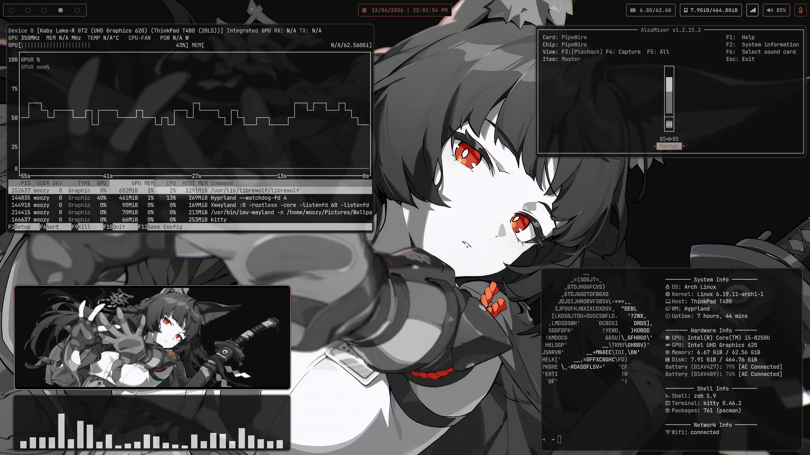
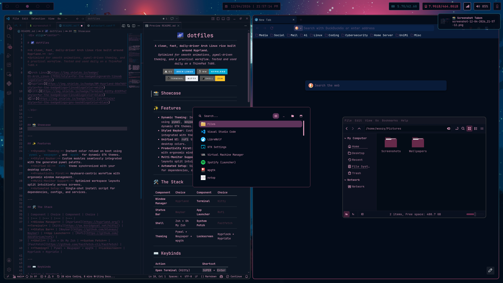
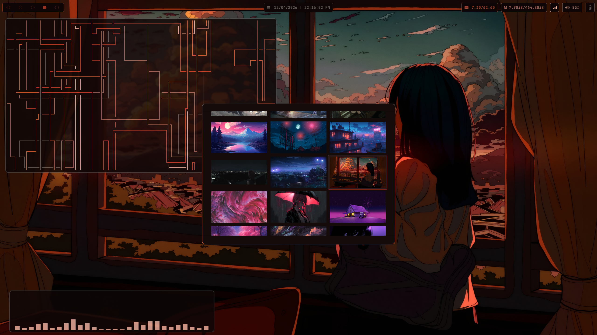

<div align="center">

# 🌌 dotfiles

**A clean, fast, daily-driver Arch Linux rice built around Hyprland.** <br>
*Optimized for smooth animations, pywal-driven theming, and a practical workflow. Tested and used daily on a ThinkPad T480.*


</div>

---

## 📸 Showcase
 
<div align="center">
  
  
  
</div>


---

## ✨ Features

- **Dynamic Theming:** Instant color reload on boot using `pywal`, `waypaper`, and `wpgtk` for dynamic GTK themes.
- **Styled Waybar:** Custom modules seamlessly integrated with the generated pywal palette.
- **Unified UI:** `rofi` theme synchronized with your desktop colors.
- **Productivity First:** Keyboard-centric workflow with ergonomic window management.
- **Multi-Monitor Support:** Optimized workspace layouts split intuitively across screens.
- **Automated Setup:** Single-shot install script for dependencies, configs, and services.

---

## 🛠️ The Stack

| Component | Choice | Component | Choice |
| :--- | :--- | :--- | :--- |
| **Window Manager** | [Hyprland](https://hyprland.org/) | **Terminal** | [Kitty](https://sw.kovidgoyal.net/kitty/) |
| **Status Bar** | [Waybar](https://github.com/Alexays/Waybar) | **App Launcher** | [Rofi](https://github.com/davatorium/rofi) |
| **Shell** | Zsh + [Oh My Zsh](https://github.com/ohmyzsh/ohmyzsh) | **System Fetch** | [Fastfetch](https://github.com/fastfetch-cli/fastfetch) |
| **Theming** | [Pywal](https://github.com/dylanaraps/pywal) + [Waypaper](https://github.com/anufrievroman/waypaper) + [wpgtk](https://github.com/deviantfero/wpgtk) | **Lockscreen** | [Hyprlock](https://github.com/hyprwm/hyprlock/) + [Hypridle](https://github.com/hyprwm/hypridle) |

---

## ⌨️ Keybinds

| Action | Shortcut |
| :--- | :--- |
| **Open Terminal** (Kitty) | `SUPER` + `Enter` |
| **App Launcher** (Rofi) | `SUPER` + `P` |
| **Web Browser** | `SUPER` + `B` |
| **File Manager** (Nemo) | `SUPER` + `F` |
| **Kill Active Window** | `SUPER` + `Q` |
| **Lock Screen** | `SUPER` + `L` |
| **Change Wallpaper** | `SUPER` + `W` |
| **Full Screenshot** | `Print` |
| **Current Monitor Screenshot** | `Alt` + `Print` |

---

## 📂 Structure

```text
~/.dotfiles/
├── assets/         # Project assets (e.g. screenshots)
├── fastfetch/      # Beautiful system info fetching
├── hypr/           # Core WM configs, rules, and scripts
├── kitty/          # GPU-accelerated terminal setup
├── local/bin/      # Custom helper and workflow scripts
├── mako/           # Notification daemon configuration
├── rofi/           # Application launcher styling
├── wal/templates/  # Pywal templates for dynamic colors
├── wallpapers/     # Curated aesthetic wallpapers
├── waybar/         # Elegant top bar styling and modules
├── waypaper/       # GUI wallpaper manager config
└── zshrc           # Zsh environment and aliases
```

---

## 🚀 Installation

You can install this setup by just downloading and running the `install.sh` script, since the script handles cloning the repository and deploying files automatically.

```bash
curl -LO https://raw.githubusercontent.com/ripwoozy/dotfiles/main/install.sh
chmod +x install.sh
./install.sh
```

> **Note:** The installer automatically clones the repo to a temporary location (`~/.dotfiles`), pulls required official and AUR packages, deploys configurations, sets default wallpapers, enables essential system services, and then cleans up.

### Modifying the Install Script
The `install.sh` script is designed to be easily tunable to your needs. If you want to add, remove, or swap packages before installing, download the script as shown above, open `install.sh` in your editor, and modify the `REPO_PKGS` array (for official Arch repos) or the `AUR_PKGS` array (for AUR packages).

For example, if you don't want `librewolf-bin` or `obsidian`, simply delete those lines from the arrays before running the script.

---

## 📌 Important Notes

- **Target OS:** Designed explicitly for **Arch Linux**.
- **Hardware:** Tested extensively and used daily on a **ThinkPad T480**.
- **Typography:** Uses **JetBrains Mono Nerd Font**. Ensure it's installed for icons to render correctly.
- **Monitors:** If your monitor names differ (e.g., `DP-1` vs `HDMI-A-1`), you will need to tweak the monitor entries in `hypr/hyprland.conf`.
- **GTK Theme:** Dynamic GTK theming is handled via **wpgtk**.

---

## 💝 Credits & Inspiration

- Heavily powered by the fantastic [Hyprland ecosystem](https://hyprland.org/).
- Dynamic colors made possible by `pywal` and `waypaper`.
- Theme inspirations guided by Aditya Shakya's amazing `rofi` setups.
